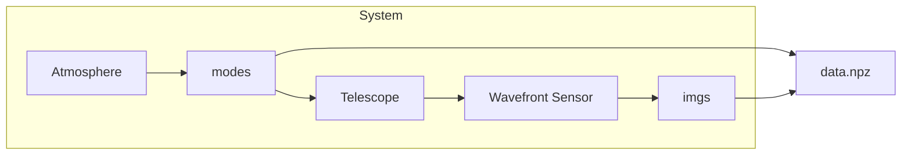

# ao-sandbox
Scripts and tools for generating adaptive optics data for statistically analysis and exploration

## WFS *information* data
In `./wfs_information` you can find scripts to generate a dataset capturing the wavefront sensing process for some inputs. Running:
```bash
./wfs_information/generate.py run
```
should be sufficient for creating a batch of data and saving it to disk in `.npz` format, but you may need to install the requirements first:
```bash
pip install -r requirements.txt
```

For more info on how to generate data, try:
```bash
./wfs_information/generate.py --help
```

The system modelled is:

with the option to pass the `--distribution uniform` setting to change the atmosphere for a uniform random distribtion with approximately equivalent strength.

#### Examples
- to create a set of training tuples `(modes,images)` saved to the file `out.npz`, you can do any of the following:
```bash
./generate.py run
./generate.py run -o out.npz  # default
./generate.py run --distribution vonkarman  # default
```
- The strength of the turbulence is parameterised by the ratio of the telescope diameter and r0 at the imaging wavelength, all of this is summarised into a single argument: `dr0`, which has a default value of 1.0, giving a wavefront error in either distribution method of close to 1.0 (less in the case of von Karman turbulence because of the finite outer scale - L0=10.0D in our case). You can reduce the effect of the atmosphere by decreasing D/r0, e.g.:
```bash
./generate.py run --dr0 0.1
```