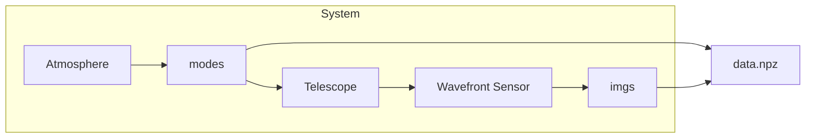

# ao-sandbox
Scripts and tools for generating adaptive optics data for statistically analysis and exploration

## WFS *information* data
In `./wfs_information` you can find scripts to generate a dataset capturing the wavefront sensing process for some inputs. Running:
```bash
./wfs_information/generate.py run
```
should be sufficient for creating a batch of data and saving it to disk in `.npz` format, but you may need to install the requirements first:
```bash
pip install -r requirements.txt
```

The system modelled is summarised as thus:

